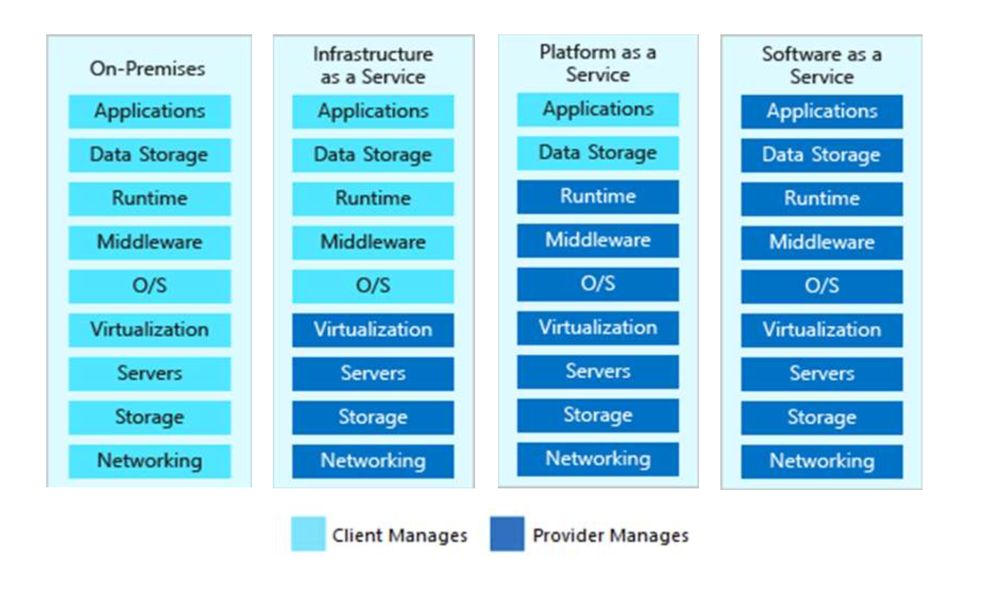
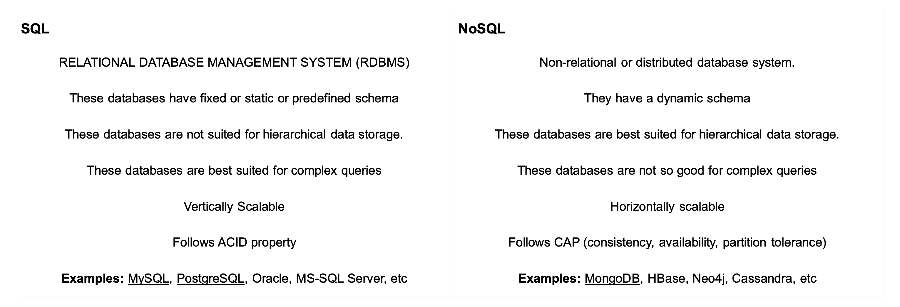
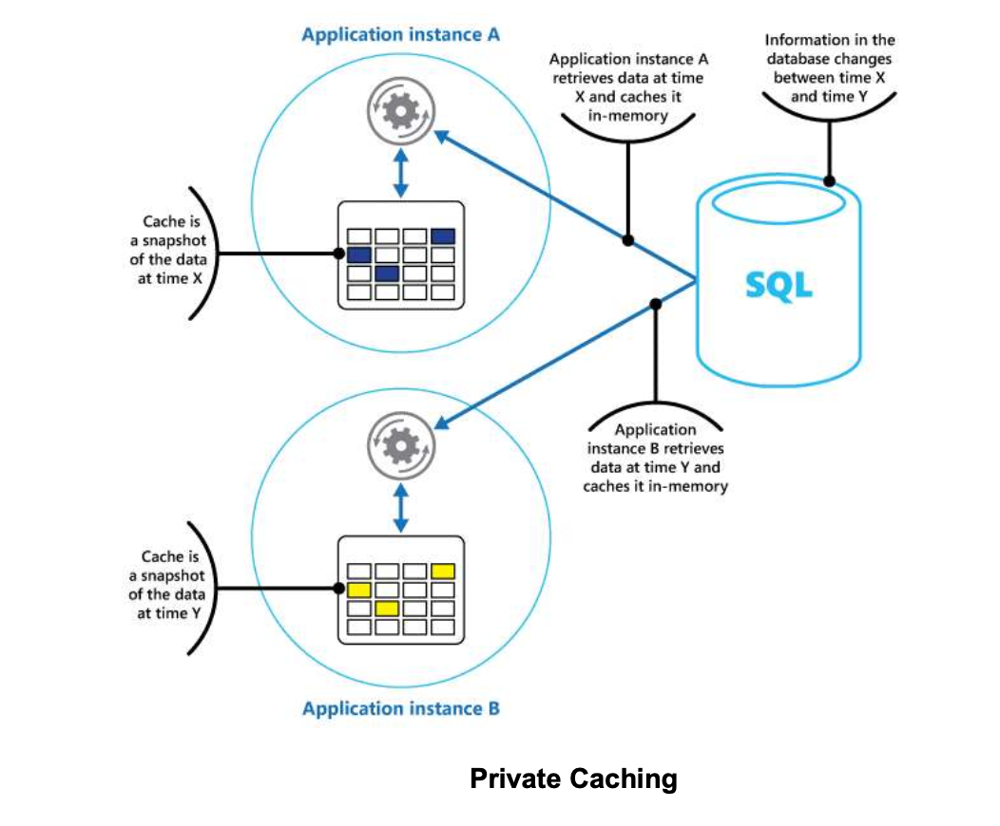
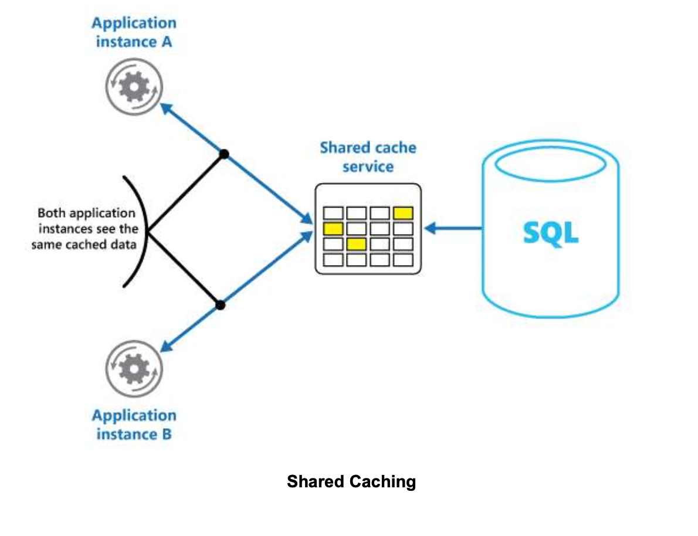
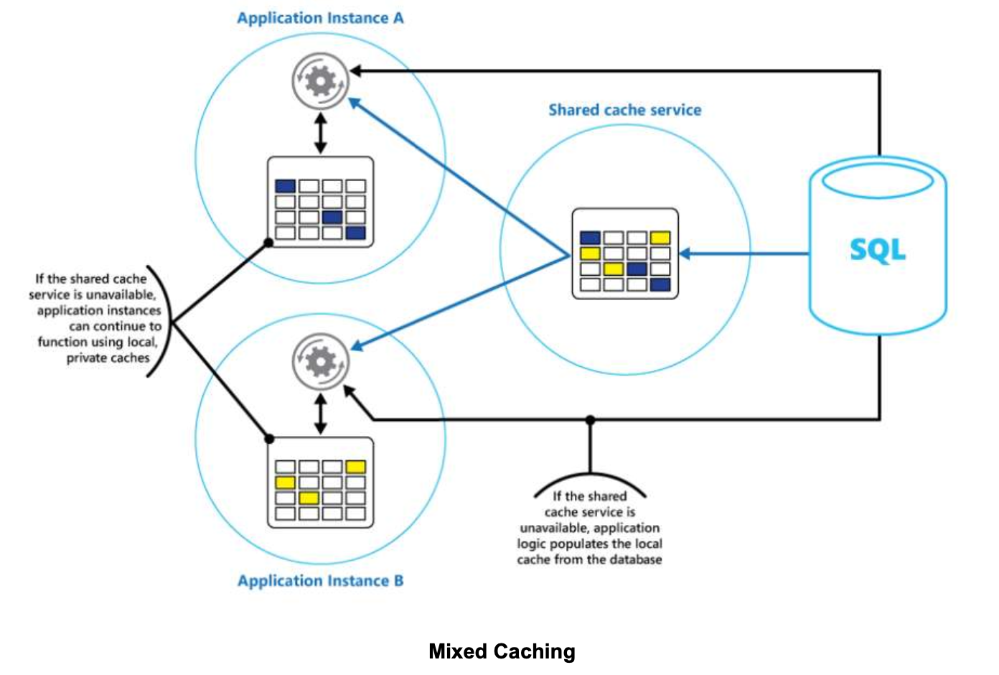
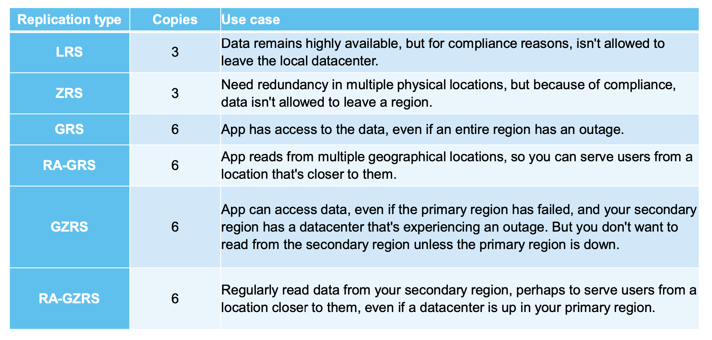
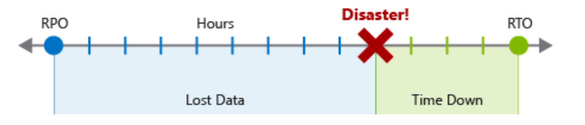
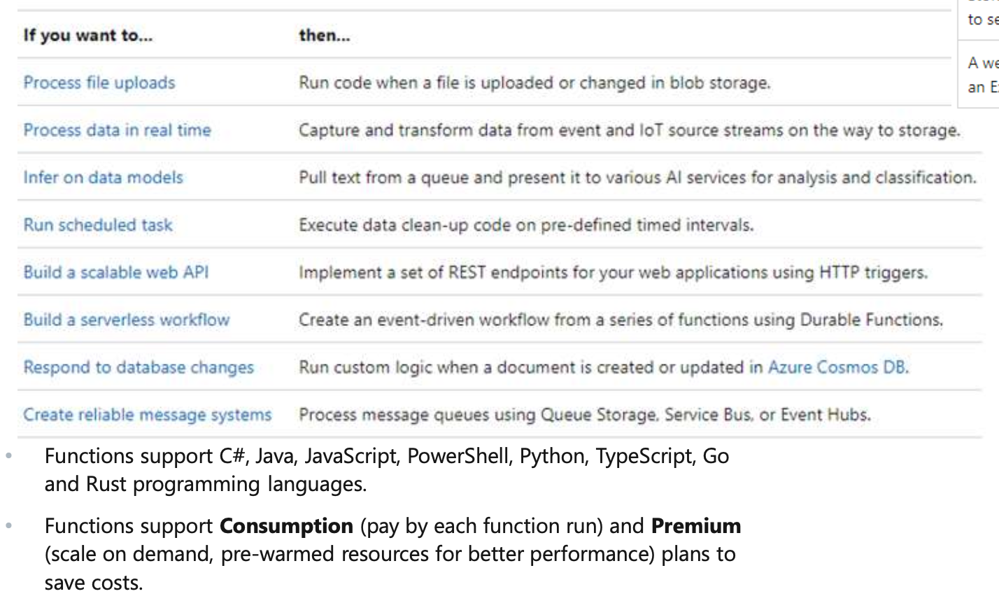
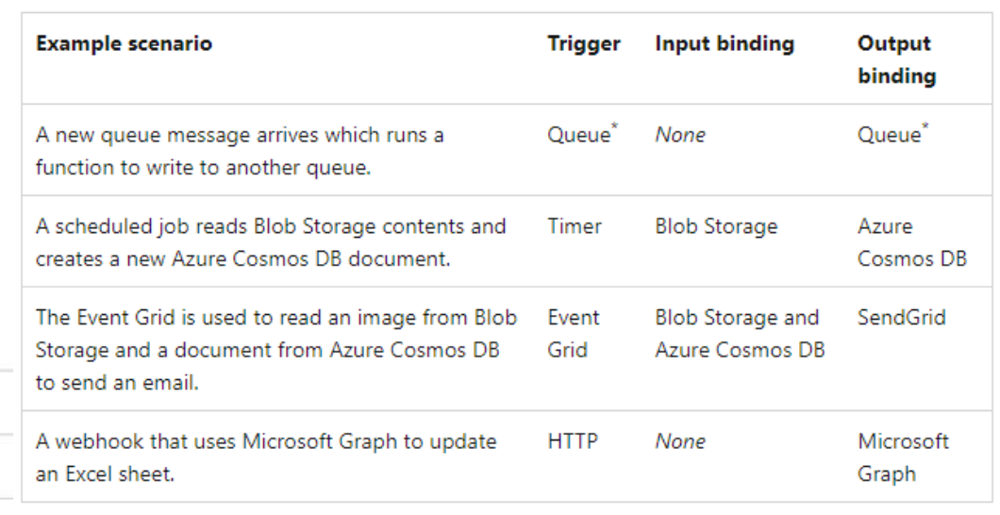

# First Week

## IaaS (Infrastructure as a Service)

IaaS provides virtualized computing resources over the internet, such as servers, storage, and networking. Provides raw infrastructure, highly customizable, user manages applications, data, middleware, and runtime.

Best for:
• Developers and businesses that want full control over their IT infrastructure.
• Hosting websites or applications with specific OS requirements.

Examples:

    •   Amazon Web Services (AWS EC2)
    •	Microsoft Azure Virtual Machines
    •	Google Cloud Compute Engine

## PaaS (Platform as a Service)

PaaS provides a platform allowing users to build, deploy, and manage applications without worrying about the underlying infrastructure. Focuses on development and deployment.

Best for:

    •	Businesses that want to focus on application logic without managing servers or runtime.

Examples:

    •	Google App Engine
    •	Heroku
    •	Microsoft Azure App Services

**Azure provides all of the above.**

Cloud Computing advantages:

    •	Availability (high percentage that the system is running in normal circumstances)
    •	Reliability (meet certain performance criteria)
    •	Scalability (horizontal: adding instances of a resource like VMs, vertical: adding RAM or CPUs to VMs)

## Cloud Deployment Models

- **On Premise (Private Cloud)**: Dedicated, owned type of installation which is managed by the company itself.
- **Hybrid Cloud**: A combination of public cloud and on-premise resources. Mostly preferrable method due to data regulations.
- **Public Cloud**: All resources are on a single public cloud like AWS, Azure, GCP, OCI, Alibaba Cloud. The solution is also called Cloud-Native.
- **Multi-Cloud**: Resources are separated on different Cloud vendors. The most preferrable Cloud-Native solution as it merges the benefits of different vendors.

## Azure Accounts

- **Resources**: Cloud resources like compute, storage and database.
- **Resource Groups**: A single resource or a group of resources to build projects.
- **Subscriptions**: A logical container to provision resources.
- **Azure Account**: A single connection that represents all resources and billing sections of a company within Microsoft Azure.

### Payments

Invoice - Applies to a single department
Billing Profile - Combination of invoice sections (sub-companies)
Billing Account - Single account responsible for whole company's spending.

### Regions & Availability Zones

• **Data Center**: A physical center that has all the Cloud environment like servers, routers, switches, firewalls, storage solutions, etc.

• **Availability Zone**: A logical zone that contains several data centers to protect against data center failures.

• **Region**: A logical collection of availability zones to protect against natural disasters.

• **Region Pair**: A paired region to build High-Available (HA) solutions.

---

#### **First week homework**

Try to learn the AWS equivalents of services. Provide a short summary.

Try to perform alternative Web Hosting services on Azure and provide a short summary about how you can do it (Tip: There are
several ways).

---

# Second Week

## Data & Data Types

**Data**: A collection of values conveying information about quantity, quality, facts, statistics, or symbols that can be interpreted.

Types:

- **Structured Data**: Structured data, sometimes referred to as relational data, is data that adheres to a strict schema, so all of the data has the same fields or properties. The shared schema allows this type of data to be easily searched with query languages such as SQL (Structured Query Language). (VERTICALLY SCALABLE)

- **Semi-Structured Data**: Semi-structured data is less organized than structured data, and is not stored in a relational format, as the fields do not neatly fit into tables, rows, and columns. Semi-structured data contains tags that make the organization and hierarchy of the data apparent - for example, key/value pairs. Semi-structured data is also referred to as non-relational or NoSQL data. The expression and structure of the data in this style is defined by a serialization language (XML, YAML, JSON). (HORIZONTALLY SCALABLE)

- **Unstructured Data**: The organization of unstructured data is ambiguous. Unstructured data is often delivered in files, such as photos or videos.

**How to choose: When your data is static, it's schema does not change, choose SQL. If not, if you're going to add new features to schemas later on use NoSQL. In some cases, when you're getting BIG DATA stuff, use unstructured data because they are kept as logs**.

## Transactions and ACID, OLAP, OLTP databases

**Transaction**: A transaction is a logical group of database operations that execute together.

- If a change in a piece of data will impact another, then Transaction is required.
- Transactions are often defined by a set of four requirements, referred to as ACID guarantees. ACID stands for Atomicity, Consistency, Isolation, and Durability:

### ACID

- Atomicity means a transaction must execute exactly once and must be atomic; either all of the work is done, or none of it is. Operations within a transaction usually share a common intent and are interdependent.
- Consistency ensures that the data is consistent both before and after the transaction.
- Isolation ensures that one transaction is not impacted by another transaction.
- Durability means that the changes made due to the transaction are permanently saved in the system. Committed data is saved by the system so that even in the event of a failure and system restart, the data is available in its correct state.
- When a database offers ACID guarantees, these principles are applied to any transactions in a consistent manner.

### OLTP (Online Transaction Processing)

Transactional databases are generally called OLTP systems.

- Supports lots of users
- Have quick response times
- Handle large volumes of data
- Has HA (Highly available) structure
- Typically handle small or relatively simple transactions.=

### OLAP (Online Analytical Processing)

- Commonly support fewer users
- Have longer response times
- Can be less available
- Typically handle large and complex transactions.

Slide 2 p21 examples for Azure blob storage vs.
Azure SQL DB (TABLE-LIKE), Azure Blob Storage (BLOBS), Azure Cosmos DB (NOSQL).

## Caching

Caching improves system performance and scalability by temporarily storing frequently accessed data in fast storage closer to the application. This reduces response times for client applications.

Effective when data:

- Is frequently read and static.
- Originates from a slow or high-contention source.
- Is far away, causing high network latency.

Caching in Distributed apps:

    •	Private Cache: Data is stored locally on the application’s machine.
    •	Shared Cache: A common cache accessible by multiple processes or machines.
    •	Client-Side Caching: Done by the user interface process (e.g., web browsers).
    •	Server-Side Caching: Done by business service processes running remotely.

### Private cache

An in-memory cache stored in a single process’s address space, providing fast access to modest amounts of static data. Its size is limited by the available memory on the host machine.

### Shared cache

If you use a shared cache, it can help alleviate concerns that data might differ in each cache, which can occur with in-memory caching. Shared caching ensures that different application instances see the same view of cached data. It locates the cache in a separate location, which is typically hosted as part of a separate service.

### Mixed Caching

A combination of both Private and Shared caching for high available / BC App. scenario.

## Data Redundancy & Replication

Data in Azure is replicated to ensure that it's always available, even if a datacenter or region becomes inaccessible or a specific piece of hardware fails. You have the following replication options:

- Locally redundant storage (LRS)
- Zone-redundant storage (ZRS)
- Geographically redundant storage (GRS)
- Read-access geo-redundant storage (RA-GRS)
- Geo-zone-redundant storage (GZRS)
- Read-access geo-zone-redundant storage (RA-GZRS)

Each replication option provides a different level of redundancy and durability.

Replication is used for business continuity and disaster recovery scenarios. Each DB has a different replication technique in Azure. Main criteria are: RTO and RPO.

- **RTO**: An RTO is a measure of the maximum amount of time your business can survive after a disaster before normal service is restored. Let's assume your RTO is 12 hours, which means that operations can continue for 12 hours without the business's core services functioning. If the downtime is 24 hours, your business would be seriously harmed.

- **RPO**: An RPO is a measure of the maximum amount of data loss that's acceptable during a disaster. A business can typically decide to do a backup every 24 hours, 12 hours, or even in real time. If a disaster occurs, there's always some data loss.

**Azure Cosmos DB** uses Built-in multi-region write copies that **Azure Cloud could** control the replication automatically.

## Migration to Cloud

Steps:

- Discover
- Assess
- Migrate
- Cutover
- Optimize

Slide 2 p39 examples for Migration.

**Oracle to Pgsql has some issues, use ora2pg.**

## Data Security

These are provided:

1. Encryption at Rest: Storage devices support AES-256, FIPS-140-2 and they are enabled by default, i.e. the data is encrypted automatically. Virtual Disks are encrypted with Disk Encryption algorithms (i.e. BitLocker for Windows, dm-crypt for Linux). Key Manager systems (i.e. Azure Key Vault) stores the keys and secrets, even if these images are downloaded, they cannot be decrypted without these keys/secrets. SQL DBs could protect columns / rows and alert if they are reached.

2. Encryption in Transit: Transport level security like HTTPS for API calls and SMB 3.0 for File shares.

3. CORS Support: Cross-Origin Resource Sharing ensures only authenticated services / apps reach to the desired media / docs.

4. RBAC: Role-Based Access Control ensures authentication and authorization levels are set accordingly.

5. Access Audit: Storage Analytics tool (in Azure) could log all activities to see which files are reached / denied by which users.
   a) Account Keys: Storage Account keys are provided to the applications for CORS support.
   b) SAS Services: Shared Access Signatures could be defined in service-level or account-level to secure the storage account.

6. Network Security: Some examples are Firewall, NSG, ASG, WAF, NVA and VPN services (will be explained later)

---

#### **Second week homework**

- Compare AWS and Azure’s DB services. Provide a short summary.
- Research and provide a summary about Azure & AWS Backup solutions.

---

# Third Week

Cloud vendors (Azure) provide the following Compute resources:

- Virtual Machines (VMs)
- Virtual Machine Scale Sets (VMSS)
- Dedicated Hosts
- Virtual Desktop Solutions & RDS
- Azure VMWare Cloud Solution
- High Performance Computing (HPC)
- App Services

## VMs

The simplest way to use the cloud compute resources. **The type is IaaS**; therefore, the user needs to maintain the O/S, middleware, application, etc.

VMs are ideal when you need;

- Total control of the O/S
- The ability to run the custom software
- To use custom hosting configurations

Use cases:

- Testing and Development
- Running apps on Cloud
- Extending the existing datacenter to the Cloud
- Disaster recovery purposes

## VMSS

The simplest way to use the scaling mechanism on VMs. The type is IaaS; therefore, the user needs to maintain the O/S, middleware, application, etc.

- VMs should be identical and supports load-balancing (max. VM capacity is 1000 VMs).
- Allows HA (High-Available) solution with auto-scaling and scheduled scaling options.
- Auto scaling depends on the metrics available on the Cloud (i.e. CPU, Memory, I/O usage).
- Scheduled scaling is to support forecasted high demand scenario.

VMSS is ideal when you need;

- Still a VM but also need auto-scaling
- The workload could be shared across identical VMs
- Large scale services to process big data

Normally, VMs are in Shared Host services.

Dedicated host service allows to dedicate the whole host to your organization. It is ideal when you need;

- Improved security & Hardware isolation.
- Generally looking for a long term contract with Cloud vendor / CapEx.
- Control over support events initiated by the Cloud vendor.
- Control the whole host maintenance.
- Business critical applications are on a single host environment.
- Different O/S on a single host.
- Comply with your organization’s corporate policies.
- Bring your own license (BYoL) feature on Azure for both O/S and databases.

---

**BYOL** is a licensing model where customers can use their existing software licenses on a new platform, such as a cloud service. It allows organizations to transfer licenses they already own, avoiding the need to purchase new ones.

Key Points:

    • Use Case: Common in cloud computing, where businesses migrate on-premises software (e.g., Windows Server, SQL Server) to cloud environments like AWS, Azure, or Google Cloud.
    • Advantages:
    • Cost savings by reusing existing licenses.
    • Flexibility to deploy software across different environments.
    • Requirements: The license must comply with the provider’s BYOL terms, including verification of eligibility.

For example, Microsoft and Oracle offer BYOL programs for their products.

---

## Virtual Desktops

Azure provides Virtual Desktops to the Enterprises; therefore, they can manage the VMs, data and the clients. Ideal for;

- Security and regulation applications, such as financial services, healthcare, and government.
- Elastic workforce needs, such as remote work, mergers and acquisitions, short-term employees, contractors, and partner access.
- Specific employees, such as bring your own device (BYOD) and mobile users, call centers, and branch workers.
- Specialized workloads, such as design and engineering, legacy apps, and software development testing.

### Remote Desktop Services

- Better security with Session-based authentication
- Keep the data in Cloud
- Keep the VMs in the DMZ

#### Azure VMWARE

- Migrating the existing VMWare solution to the Cloud.
- Increasing the existing VMWare capacity.
- Building the VMWare and Azure native solution architecture.

#### High Performance Computing (HPC)

- Many industries use HPC to solve some of their most difficult problems. These include workloads such as; Genomics, Oil and gas simulations, Finance, Semiconductor design, Engineering, Weather modeling, etc.
- Specific H-Series (High CPU load) or N-Series (NVIDIA supported high GPU load) VMs are used for this purpose.
- Azure Batch service is used to manage tasks and parallel computing.
- Some use cases are; finite element analysis, computer aided design, 3D model rendering, DNA analysis, fluid dynamics…

#### App Services

HTTP based App Service enables you to build and host web apps, background jobs, mobile back-ends, and RESTful APIs in the programming language of your choice without managing infrastructure.

- App Service is a PaaS platform and despite IaaS solutions, infrastructure is managed by Azure.
- Supports auto scaling with built-in auto scale mechanism.
- Supports CI/CD processes with direct connections to various code sources like Azure DevOps, GitHub, Bitbucket, Dropbox, etc.

---

#### **Second week homework**

- Compare AWS and Azure’s Compute services (except serverless). Provide a short summary.
- Research and provide a summary about Cloud Infrastructure automation solutions.
- Search about Unikernel infrastructures and provide a short summary.

---

# Fourth Week

## Kubernetes

Kubernetes is a cluster of virtual or on-premises machines. These machines—called nodes—share compute, network, and storage resources. Each cluster has one master node connected to one or more worker nodes. The worker nodes are responsible for running groups of containerized applications and workloads, known as pods, and the master node manages which pods run on which worker.

Kubernetes cluster is divided into two components:

- Control plane: provides the core Kubernetes services and orchestration of application workloads.
- Nodes: run your application workloads.

- A Kubernetes cluster contains at least one main plane and one or more nodes. Both the control planes and node instances can be physical devices, virtual machines, or instances in the cloud. The default host OS in Kubernetes is Linux, with default support for Linux-based workloads.
- The Kubernetes control plane in a Kubernetes cluster runs a collection of services that manage the orchestration functionality in Kubernetes.
- A node in a Kubernetes cluster is where your compute workloads run. Each node communicates with the control plane via the API server to inform it about state changes on the node.

- Developers and operators interact with the cluster primarily through the master node by using kubectl, a command-line interface that installs on their local OS. Commands issued to the cluster through kubectl are sent to the kube-apiserver, the Kubernetes API that resides on the master node. The kube-apiserver then communicates requests to the kube-controller-manager in the master node, which is in turn responsible for handling worker node operations. Commands from the master node are sent to the kubelet on the worker nodes.
- The master node maintains the current state of the Kubernetes cluster and configuration in the etcd, a key value store database. To run pods with your containerized apps and workloads, you must describe a new desired state to the cluster in the form of a YAML file. The kube-controller-manager takes the YAML file and tasks the kube-scheduler with deciding which worker nodes the app or workload should run based on predetermined constraints. Working in concert with each worker node’s kubelet, the kube-scheduler starts the pods, watches the state of the machines, and is overall responsible for the resource management.

- Azure Kubernetes Service (AKS). AKS is a managed Kubernetes cluster hosted in the Azure cloud. Azure manages the Kubernetes API service, and you only need to manage the agent nodes.

- Virtual network. By default, AKS creates a virtual network into which agent nodes are connected. You can create the virtual network first for more advanced scenarios, which lets you control things like subnet configuration, on-premises connectivity, and IP addressing.

- An ingress server exposes HTTP(S) routes to services inside the cluster.
- Azure Load Balancer. Once the AKS cluster is created, the cluster is ready to use the load balancer. Then, once the NGINX service is deployed, the load balancer is configured with a new public IP that will front your ingress controller. This way, the load balancer routes internet traffic to the ingress.
- External data stores. Microservices are typically stateless and write state to external data stores, such as Azure SQL Database or Azure Cosmos DB.
- Azure Active Directory. AKS uses an Azure Active Directory (Azure AD) identity to create and manage other Azure resources such as Azure load balancers. Azure AD is also recommended for user authentication in client applications.
- Azure Container Registry. Use Container Registry to store private Docker images, which are deployed to the cluster. AKS can authenticate with Container Registry using its Azure AD identity. AKS doesn't require Azure Container Registry. You can use other container registries, such as Docker Hub.
- Azure Monitor. Azure Monitor collects and stores metrics and logs, application telemetry, and platform metrics for the Azure services. Use this data to monitor the application, set up alerts, dashboards, and perform root cause analysis of failures. Azure Monitor integrates with AKS to collect metrics from controllers, nodes, and containers.

## Container Apps

- Azure Container Apps enables you to build serverless microservices and jobs based on containers.
- Container Apps is optimized for running general purpose containers, especially for applications that span many microservices deployed in containers.
- Container Apps is powered by Kubernetes and open-source technologies like Dapr, KEDA, and envoy.
- Container Apps supports Kubernetes-style apps and microservices with features like service discovery and traffic splitting.
- Container Apps enables event-driven application architectures by supporting scale based on traffic and pulling from event sources like queues, including scale to zero.
- Container Apps supports running on demand, scheduled, and event-driven jobs.
- Azure Container Apps doesn't provide direct access to the underlying Kubernetes APIs. If you require access to the Kubernetes APIs and control plane, you should use Azure Kubernetes Service.

## Container Instances

Azure Container Instances (ACI) provides a single pod of Hyper-V isolated containers on demand.

- It's a simpler and more flexible option than Container Apps.
- Concepts like scale, load balancing, and certificates aren't provided with ACI containers.
- Users often interact with Azure Container Instances through other services.
- For example, Azure Kubernetes Service can layer orchestration and scale on top of ACI through virtual nodes.
- If you need a less "opinionated" building block that doesn't align with the scenarios Azure Container Apps is optimizing for, Azure Container Instances is an ideal option.

## Azure Functions

- Azure Functions is a serverless solution that allows you to write less code,
  maintain less infrastructure, and save on costs.
- Functions provides a comprehensive set of event-driven triggers and bindings that connect your functions to other services without having to write extra code.

week4 page 10 has some examples of schedule jobs, stream and event processing etc.

---

#### **Second week homework**

- Compare AWS and Azure’s Container & Serverless compute services. Provide a short summary.
- Research and provide a summary about the differences between the Cloud Network and Traditional Network.

---

EXAM QUESTIONS:

You have an on-premises network that contains 100 servers.
You need to recommend a solution that provides additional resources to your users. The solution must minimize capital and operational expenditure costs.
What should you include in the recommendation?

Your company has an on-premises network that contains multiple servers.
The company plans to reduce the following administrative responsibilities:
✑ Backing up application data
✑ Replacing failed server hardware
✑ Managing physical server security
✑ Updating server operating systems
✑ Managing permissions to shared documents
The company plans to migrate servers to Azure virtual machines.
You need to identify which administrative responsibilities will be eliminated after the planned migration.
Which two responsibilities should you identify? Each correct answer presents a complete solution.
NOTE: Each correct selection is worth one point.

A. Replacing failed server hardware
B. Backing up application data
C. Managing physical server security
D. Updating server operating systems
E. Managing permissions to shared documents

Correct answ: A C

---

You have an on-premises network that contains 100 servers.
You need to recommend a solution that provides additional resources to your users. The solution must minimize capital and operational expenditure costs.
What should you include in the recommendation?

A. a complete migration to the public cloud
B. an additional data center
C. a private cloud
D. a hybrid cloud

D

---

You architect a solution that calculates 3D geometry from height map data.
You have the following requirements:
Perform calculations in Azure.
Each node must communicate data to every other node.
Maximize the number of nodes to calculate multiple scenes as fast as possible.
Require the least amount of effort to implement.
You need to recommend a solution. Which two actions should you recommend?

A. Create a render farm that uses Azure Batch.
B. Create a render farm that uses virtual machines (VMs).
C. Enable parallel task execution on compute nodes.
D. Create a render farm that uses virtual machine (VM) scale sets.
E. Enable parallel file systems on Azure.

A C

---

You plan to migrate a web application to Azure. The web application is accessed by external users.
You need to recommend a cloud deployment solution to minimize the amount of administrative effort used to manage the web application.
What should you include in the recommendation?

A. Software as a Service (SaaS)
B. Platform as a Service (PaaS)
C. Infrastructure as a Service (IaaS)
D. Database as a Service (DaaS)

B

---

Security in Cloud is only the responsibility of Cloud vendor. FALSE

Security posture defines the CIA. TRUE

Sentinel is the SIEM tool of Microsoft Azure. TRUE

JIT-access-control is used to provide on time access to all resources in cloud. FALSE

Azure security center could monitor on-prem resources. TRUE

ML could help to improve the security on cloud. TRUE

---

which redundancy provides redundancy for data center failures - Zone Redun
which redundancy provides redundancy for regional disasters - Geog/Regional Redun
which redundancy provides redundancy for server failures - Host Redun
which redundancy provides redundancy for on-prem core switch failures - Switch Redun
which redundancy provides redundancy for on-prem link failures - Link
which redundancy provides redundancy for on prem eth interface failure - NIC

---

A company can extend a private cloud by adding its on physical servers to the public cloud. FALSE
To build a hybrid cloud, you must deploy resources to the public cloud. TRUE
A private cloud must be disconnected from the internet. - FALSE
Azure Cosmos DB is an example of a Paas offering - TRUE
A dedicated host is an example of an Opex spending. - FALSE
Private caching is an example of HA scenario. - FALSE
Serverless solutions are examples of SaaS offering. - FALSE
The main difference between a VM and a Container is the GuestOS availability. - FALSE
DB migrations for Business Critical Apps are generally done with Lift&Shift method. - FALSE
DB replication for MySQL on Azure is the responsibility of cloud vendor. - TRUE

---

Your company is planning to implement the business continuity and disaster recovery for various virtual machines that host finance applications in the company's on-premises data center. The finance application requires that data must be retained for seven years. In the event of a disaster, the application must be able to run from Azure. The recovery time objective (RTO) is 10 minutes. You need to recommend the Azure services to meet the business continuity and disaster recovery objectives. The solution must minimize costs. What should you recommend for finance applications?

Azure Backup and Site Recovery

---

You have a web app named myapp1 that is hosted in on-premises and on four Azure virtual machines (VMs). Each virtual machine is in a different region. You need to recommend a solution to ensure that users will always connect to the closest instance of myapp 1. The solution must prevent the users from attempting to connect to a failed instance of myapp 1.
Which two possible recommendations achieve the goal? Each corfect answer presents a complete solution.

Azure Front Door Service

Azure Traffic Manager

---

Encryption in transit is the security technique to protect data while transferring.
RBAC ensures authentication and authorization levels are set accordingly.
